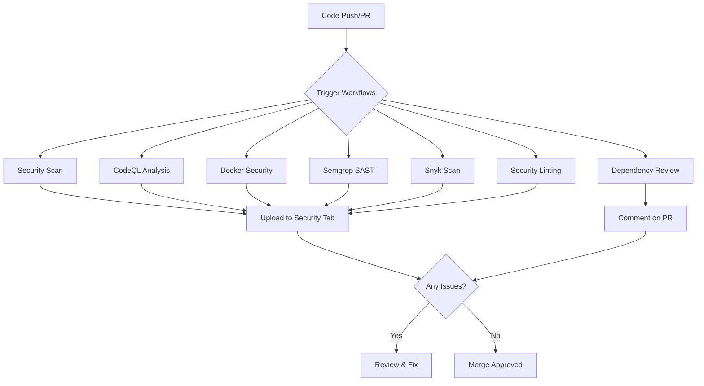

# CMMS Security Infrastructure

> Comprehensive security setup for the Computerized Maintenance Management System

## 🔒 Security Overview

This project implements enterprise-grade security measures including automated vulnerability scanning, secret detection, code analysis, and container security.

## 📊 Quick Status

Check the current security status:
- 🔍 [Security Overview](../../security)
- 🛡️ [Dependabot Alerts](../../security/dependabot)
- 📋 [Code Scanning](../../security/code-scanning)
- 🔑 [Secret Scanning](../../security/secret-scanning)

## 🎯 Security Features

### Automated Security Scanning

| Feature | Status | Frequency |
|---------|--------|-----------|
| Dependency Scanning (Dependabot) | ✅ Active | Real-time |
| Code Scanning (CodeQL) | ✅ Active | Weekly |
| Secret Scanning | ✅ Active | On push |
| Container Scanning (Trivy) | ✅ Active | Weekly |
| SAST (Semgrep) | ✅ Active | Weekly |
| Vulnerability Scanning (Snyk) | ⚙️ Optional | Weekly |
| Security Linting | ✅ Active | On push/PR |
| Pre-commit Hooks | ⚙️ Manual Setup | On commit |

### Security Tools Integrated

#### GitHub Native
- ✅ Dependabot - Dependency vulnerability alerts & updates
- ✅ CodeQL - Semantic code analysis
- ✅ Secret Scanning - Detect committed secrets
- ✅ Dependency Review - PR-based dependency checks

#### Third-Party (Open Source)
- ✅ Trivy - Container & filesystem vulnerability scanner
- ✅ Semgrep - Pattern-based static analysis
- ✅ TruffleHog - Secret scanning
- ✅ Bandit - Python security linter
- ✅ ESLint Security Plugin - JavaScript/TypeScript security
- ✅ Safety - Python dependency checker

#### Third-Party (Commercial - Optional)
- ⚙️ Snyk - Comprehensive security platform
- ⚙️ SonarCloud - Code quality & security

## 📚 Documentation

| Document | Description |
|----------|-------------|
| [SECURITY.md](../../SECURITY.md) | Security policy and vulnerability reporting |
| [SECURITY_SETUP.md](SECURITY_SETUP.md) | Detailed setup instructions |
| [SECURITY_TOOLS.md](SECURITY_TOOLS.md) | Tools configuration and usage |

## 🚀 Quick Start

### For Developers

1. **Clone and setup**:
```bash
git clone https://github.com/srikar9894u/CMMS.git
cd CMMS
```

2. **Install pre-commit hooks** (recommended):
```bash
pip install pre-commit
pre-commit install
```

3. **Run security checks before committing**:
```bash
pre-commit run --all-files
```

4. **Check dependencies**:
```bash
# Backend
cd backend && npm audit

# Frontend
cd frontend && npm audit

# OPC Service
cd opc-service && pip install safety && safety check
```

### For Administrators

1. **Enable GitHub security features** (one-time setup):
   - Go to [Security Settings](../../settings/security_analysis)
   - Enable: Dependabot alerts, Dependabot security updates
   - Enable: Code scanning, Secret scanning, Push protection

2. **Configure branch protection**:
   - Go to [Branch Settings](../../settings/branches)
   - Add rule for `main`/`master` branch
   - Require status checks: All security workflows

3. **Add Snyk token** (optional):
   - Sign up at [snyk.io](https://snyk.io)
   - Get API token from account settings
   - Add as repository secret: `SNYK_TOKEN`

## 🔄 Automated Workflows

### Security Scan Workflows



### Workflow Schedule

- **Daily**: Dependabot checks
- **Weekly**:
  - Monday 9 AM: Security Scan (npm, safety, secrets, Trivy)
  - Tuesday 10 AM: Semgrep SAST
  - Wednesday 3 AM: CodeQL Analysis
  - Thursday 11 AM: Snyk Security
  - Sunday 2 AM: Docker Security
- **On Every PR**: Dependency Review, Security Linting
- **On Every Push**: All applicable workflows

## 📈 Security Metrics

Track security health:
- **Vulnerability Count**: Check Dependabot alerts
- **Code Quality**: Review CodeQL findings
- **Secret Exposure**: Monitor secret scanning
- **Container Security**: Review Trivy reports
- **Dependency Health**: Check npm audit results

## 🛡️ Security Layers

### 1. Prevention (Before Commit)
- Pre-commit hooks detect issues locally
- ESLint catches security patterns
- Bandit scans Python code
- Secret detection prevents leaks

### 2. Detection (On Push/PR)
- CodeQL analyzes code semantically
- Semgrep runs pattern-based SAST
- Dependency Review checks new packages
- Trivy scans containers
- Multiple secret scanners

### 3. Monitoring (Continuous)
- Dependabot monitors dependencies 24/7
- Weekly scheduled scans
- SBOM generation for supply chain visibility
- Security dashboards

### 4. Response (On Alert)
- Automated PRs for fixable issues
- Security tab aggregates all findings
- Email notifications for critical issues
- Clear remediation guidance

## 🔧 Configuration Files

```
CMMS/
├── .github/
│   ├── workflows/
│   │   ├── security-scan.yml          # Main security scan
│   │   ├── codeql-analysis.yml        # CodeQL
│   │   ├── dependency-review.yml      # Dependency checks
│   │   ├── docker-security.yml        # Container scanning
│   │   ├── semgrep.yml                # Semgrep SAST
│   │   ├── snyk-security.yml          # Snyk (optional)
│   │   ├── linting-security.yml       # Security linting
│   │   └── sbom-generation.yml        # SBOM generation
│   ├── dependabot.yml                 # Dependabot config
│   ├── SECURITY_SETUP.md              # Setup guide
│   ├── SECURITY_TOOLS.md              # Tools documentation
│   └── ISSUE_TEMPLATE/
│       └── security_vulnerability.yml # Security issue template
├── .pre-commit-config.yaml            # Pre-commit hooks
├── .eslintrc.security.json            # ESLint security rules
├── opc-service/.bandit                # Bandit config
└── SECURITY.md                        # Security policy
```

## 🎓 Learning Resources

### Security Training
- [OWASP Top 10](https://owasp.org/www-project-top-ten/)
- [CWE Top 25](https://cwe.mitre.org/top25/)
- [Snyk Learn](https://learn.snyk.io/)
- [GitHub Security Lab](https://securitylab.github.com/)

### Tool Documentation
- [CodeQL Docs](https://codeql.github.com/docs/)
- [Semgrep Docs](https://semgrep.dev/docs/)
- [Trivy Docs](https://aquasecurity.github.io/trivy/)
- [Bandit Docs](https://bandit.readthedocs.io/)

### Best Practices
- [GitHub Security Best Practices](https://docs.github.com/en/code-security)
- [NIST Cybersecurity Framework](https://www.nist.gov/cyberframework)
- [OWASP ASVS](https://owasp.org/www-project-application-security-verification-standard/)

## 🚨 Incident Response

### If You Find a Vulnerability

1. **DO NOT** create a public GitHub issue
2. **DO** use [Private Security Advisory](../../security/advisories/new)
3. **OR** email: srikar.989@gmail.com
4. Include: Description, reproduction steps, impact assessment

### Response Timeline
- Initial response: Within 48 hours
- Status update: Within 7 days
- Fix deployment: Critical issues within 30 days

## 💡 Tips for Developers

### Before Committing
```bash
# 1. Run pre-commit checks
pre-commit run --all-files

# 2. Check for secrets
git diff | grep -i "password\|secret\|token\|api_key"

# 3. Run security linters
cd backend && npx eslint . --ext .ts
cd opc-service && bandit -r .
```

### Reviewing Dependabot PRs
1. Check the CVE details link
2. Review the changelog of the update
3. Test locally if it's a major update
4. Merge security updates quickly
5. Don't ignore or dismiss without review

### Handling False Positives
```typescript
// For ESLint - add comment with justification
// eslint-disable-next-line security/detect-object-injection -- key is validated
const value = obj[key];
```

```python
# For Bandit - use nosec with reason
import subprocess  # nosec B404 - Required for PLC communication
```

## 📞 Support

- **Security Questions**: srikar.989@gmail.com
- **GitHub Issues**: [Report non-security bugs](../../issues)
- **Documentation**: [Security Setup Guide](SECURITY_SETUP.md)

## 📜 License & Compliance

- All security tools used are open-source or have free tiers
- No external data is sent to third parties without explicit configuration
- SBOM generated for supply chain transparency
- License compliance checked automatically

## 🔄 Maintenance

This security infrastructure is actively maintained:
- Workflows updated monthly
- Security tools updated quarterly
- Documentation reviewed monthly
- Configuration tested on every release

**Last Review**: October 2025
**Next Review**: November 2025

---

**Security Team**: CMMS Maintainers
**Contact**: srikar.989@gmail.com
**GitHub**: [@srikar9894u](https://github.com/srikar9894u)

---

<div align="center">

### 🛡️ Security is a Team Sport 🛡️

Everyone is responsible for security. If you see something, say something.

[Report a Vulnerability](../../security/advisories/new) | [View Security Policy](../../SECURITY.md) | [Security Tools Guide](SECURITY_TOOLS.md)

</div>
